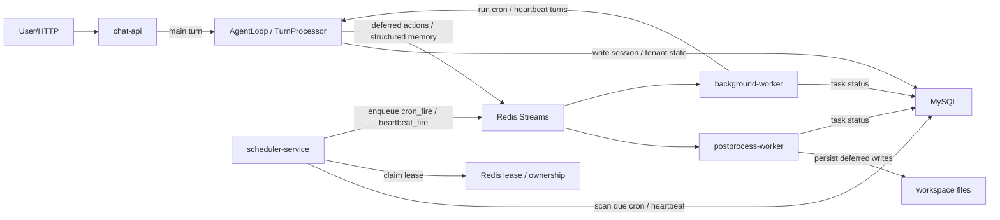

# 多服务运行时拆分思考

## 1. 这是不是微服务架构

先说结论：**方向上是在往微服务架构走，但现阶段更准确地说，是“运行时按职责拆分的多服务架构”**，还不一定要立刻走到完整微服务体系。

原因：

- 现在我们的核心诉求，不是先把代码仓库拆成很多小仓库。
- 也不是先引入一整套复杂的服务治理、注册发现、网关、配置中心。
- 当前最现实的问题，是：主聊天、cron、heartbeat、postprocess、subagent、未来 event follow-up 这些不同类型任务，正在共享同一进程资源，彼此会互相影响。
- 所以我们优先要做的是：**按职责拆运行时链路**，而不是先做“组织意义上的微服务化”。

换句话说：

- **短期目标**：一个 repo，多种服务角色，不同角色可独立启动。
- **中期目标**：服务之间通过清晰协议通信，可独立扩缩容。
- **长期目标**：如果业务真的需要，再往完整微服务体系、分布式队列和服务治理演进。

## 2. 当前单服务架构的问题

现在虽然已经有：

- tenant 隔离
- session mailbox / worker
- lane 并发配额
- backlog cap
- deferred postprocess

但是这些能力本质上都还运行在**同一个大服务进程**里。

这会带来几个实际问题：

### 2.1 不同任务类型共享同一份计算资源

例如同一时刻：

- 50 个用户发主聊天消息
- 30 个 cron 到点
- 20 个 heartbeat due
- 10 个 postprocess 在写 memory / heartbeat / cron

虽然逻辑上 lane 做了隔离，但它们仍然共享：

- 同一个 Python 进程
- 同一个事件循环
- 同一个模型出口
- 同一台机器的 CPU / 内存 / 网络

所以现状是：

- **不会完全失控**
- 但**会一起变慢**

### 2.2 高优先级任务和低优先级任务混在一起

主聊天和后台任务的重要性不一样：

- 主聊天：用户盯着等，最怕首 token 变慢
- cron / heartbeat：允许一定程度排队和延迟
- postprocess：更允许后台慢一点执行

现在它们虽然 lane 不同，但还是在一个服务里竞争整体资源。

### 2.3 故障域没有完全隔离

例如：

- heartbeat 调度器异常
- postprocess 堵住
- cron 任务突然爆发

虽然不一定直接把服务打死，但都会影响主聊天链路的整体稳定性和排障复杂度。

## 3. 为什么要做多服务运行时拆分

这一步不是为了“看起来高级”，而是为了明确解决下面这些问题：

### 3.1 让主聊天不被后台任务拖慢

如果主聊天独立成单独服务：

- 它只接用户消息
- 只跑主 session 的 turn
- cron / heartbeat / postprocess 不再和它共享同一进程资源

这样主聊天的：

- 首 token
- 平均响应时间
- 队列长度

都会更稳定。

### 3.2 可以按职责单独扩容

如果某阶段出现：

- 主聊天流量大
- 但 cron 很少

那只扩 `chat-api` 即可。

如果某阶段：

- heartbeat / follow-up 很多
- 主聊天还好

那只扩调度和后台 worker 即可。

### 3.3 故障隔离更清晰

例如：

- `scheduler-service` 出问题，不应该直接拖死 `chat-api`
- `postprocess-worker` 堵住，不应该影响用户对话首 token

### 3.4 为后续可靠队列和分布式扩展做准备

如果未来真的要做：

- 持久化消息队列
- 分布式 session ownership
- ack / retry / dead letter
- 横向扩展 worker

那么先把职责边界拆清楚，是必要前置条件。

## 4. 目标拆分蓝图

## 4.1 `chat-api`

职责：

- 接收外部用户请求
- 提供 `/turn`、`/turn/stream`
- 维护主聊天 session mailbox / worker
- 执行主聊天 turn
- 返回用户回复

不负责：

- cron 调度扫描
- heartbeat 调度扫描
- follow-up 调度扫描
- 后台持久化任务消费

特点：

- 高优先级
- 最关注延迟和稳定性
- 后续可以做多副本扩展，但需要 session ownership 配合

## 4.2 `scheduler-service`

职责：

- 定期扫描 due 的 cron / heartbeat / follow-up
- 找到目标 tenant / session / channel / chat_id
- 生成标准化任务并投递给对应 worker

不负责：

- 直接承接用户聊天 API
- 直接承担重的主对话生成

包含：

- cron scheduler
- heartbeat scheduler
- future: event follow-up scheduler

特点：

- 更偏“定时编排服务”
- 可以容忍一定延迟
- 更关注一致性和可观测性

## 4.3 `postprocess-worker`

职责：

- 消费 deferred write actions
- structured memory 提取与持久化
- heartbeat / cron / memory 文件写入
- future: 一些异步整理任务

不负责：

- 主聊天回复
- 主动调度 cron / heartbeat

特点：

- 典型后台 worker
- 吞吐比低延迟更重要

## 4.4 `subagent-worker`

职责：

- 承担 spawn / subagent 的后台执行
- 运行相对独立、可能更重的子任务

不负责：

- 主聊天实时响应

特点：

- 可与主聊天彻底解耦
- 后续适合独立并发控制和资源配额

## 4.5 `followup-worker`（未来）

职责：

- 消费 follow-up 事件
- 检查近期对话、用户状态、待跟进事项
- 决定是否发 follow-up 或写入 follow-up state

不负责：

- 主聊天入口

特点：

- 会和 heartbeat 有一定关系，但语义不同
- 更适合独立编排

## 5. 服务之间如何通信

这是多服务拆分前必须先定义清楚的。

先不急着选具体中间件，先定义**通信模型**。

## 5.1 推荐思路：先定义任务协议，再决定底层实现

任务协议要统一，至少包含：

- `task_type`
- `tenant_key`
- `session_key`
- `channel`
- `chat_id`
- `payload`
- `trace_id`
- `created_at`

例如：

- `chat_turn`
- `cron_fire`
- `heartbeat_fire`
- `postprocess_actions`
- `structured_memory_extract`
- `event_followup_check`

好处：

- 先把边界定清楚
- 以后不管走 HTTP、Redis、RabbitMQ 还是别的实现，任务结构都不需要重做

### 5.1.1 一个关键澄清：`scheduler-service` 不是“队列本身”

这里很容易理解偏。

更准确的关系应该是：

- `scheduler-service`：负责**发现 due 任务、生成任务、投递任务**
- `message queue / task queue`：负责**承载任务、排队、投递给 worker**
- `worker`：负责**消费任务并执行**

所以不是：

- scheduler 本身等于队列

而是：

- scheduler 是**任务生产者 / 编排者**
- 队列是**任务通道**
- worker 是**任务执行者**

例如：

- `scheduler-service` 扫描到 tenant-a 的 heartbeat due
- 它构造一个 `heartbeat_fire` 任务
- 然后把这个任务投递到队列
- 对应 worker 再去消费和执行

### 5.1.2 另一个关键澄清：不是所有任务都由主模型产出

任务来源要分开理解：

#### 来源 A：主聊天链路中的模型输出

这一类任务，是主模型在 turn 中决定的，例如：

- `postprocess_actions`
- `structured_memory_extract`
- 未来一部分 `followup_suggested`

也就是说：

- 用户先发消息给 `chat-api`
- 主模型完成回复
- 在回复过程中或回复后，系统根据主模型结果生成后台任务

#### 来源 B：调度器扫描产生

这一类任务，不是主模型先产出的，而是调度器根据状态直接产生，例如：

- `cron_fire`
- `heartbeat_fire`
- 未来 `event_followup_check`

也就是说：

- scheduler 根据数据库/状态存储判断“谁到点了”
- 然后直接生成任务投递给队列

所以正确理解不是：

- “主模型产出任务，调度服务分配”

而是：

- **主模型会产出一部分后台任务**
- **scheduler 也会独立产出一部分后台任务**
- 两者最后都进入统一任务通道，再由 worker 消费

## 5.2 短期实现方式

短期可以先保留轻实现，例如：

- 进程内调用
- 或简单 HTTP 调用

重点不是先上最重的基础设施，而是把任务边界和语义理顺。

### 5.2.1 为什么不建议服务之间大量互调 HTTP

外部对 `chat-api` 用 HTTP 很自然，因为用户在等待结果。

但服务之间如果大量走 HTTP，会逐渐出现这些问题：

- 调用链太长
- 超时和重试逻辑到处都是
- 不适合积压和削峰
- 后台任务不能自然排队

所以更推荐：

- 外部请求：HTTP
- 内部后台任务：任务队列

## 5.3 中长期实现方式

如果后续并发和可靠性要求提高，再换成：

- 持久化消息队列
- 独立 worker 消费

### 5.3.1 推荐的分层通信模型

当前比较适合的分层思路是：

- 外部请求：HTTP
- 后台任务：消息队列 / 任务队列
- 共享状态：共享存储
- ownership / busy：lease / 锁

一句话就是：

**同步走 API，异步走队列，状态放共享存储，协调靠锁。**

### 5.3.2 当前推荐理解（对现阶段方案的再澄清）

可以把当前准备演进的目标，理解成下面这样：

#### 1. `chat-api` 仍然是主会话入口

- 外部用户请求继续走 HTTP
- 主聊天 turn 仍然在 `chat-api` 里执行
- session mailbox / worker 仍然优先服务主对话

也就是说：

- 主会话对话仍然是一条独立、高优先级服务链路

#### 2. `scheduler-service` 负责“扫描型任务”

它的职责重点是：

- cron due 扫描
- heartbeat due 扫描
- future: event follow-up due 扫描

它发现任务后：

- 构造标准化任务
- 投递到内部任务队列

所以它更像：

- 定时编排器
- 任务发现者
- 调度入口

#### 3. 主聊天结束后产生的后台任务，不一定先经过 `scheduler-service`

这是一个非常重要的区别。

像这些任务：

- `postprocess_actions`
- `structured_memory_extract`
- future: 某些 follow-up 建议任务

它们通常是在主聊天回合结束后，由 `chat-api` 直接生成的。

这类任务更合理的路径是：

- `chat-api` 直接把任务投到内部队列
- 对应 worker 直接消费

而不是：

- 先交给 `scheduler-service` 再转发

因为这类任务不是“定时扫描发现”的，而是“回合完成后立即产生”的。

所以更准确地说：

- `scheduler-service` 主要负责**扫描型 / 定时型任务**
- `chat-api` 也会直接向队列投递**回合派生型后台任务**

#### 4. 共享状态不是“各服务进程内共享”，而是“跨服务共享权威状态来源”

当前推荐理解里，“共享状态”指的是：

- 不同服务都访问同一个权威状态来源

而不是：

- 各服务在自己进程里各持一份状态，再彼此同步

短期更现实的建议是：

- Redis：承接队列、lease、busy、ownership、短期运行时协调
- workspace 文件：继续承接 memory / prompt / override 等内容

中期再逐步把更适合做权威状态、可查询、可恢复的内容迁到 MySQL。

#### 5. 所以当前最合理的短期图景应该是

- 外部：`HTTP -> chat-api`
- 主聊天：`chat-api` 内部完成
- 扫描型后台任务：`scheduler-service -> queue -> worker`
- 回合派生型后台任务：`chat-api -> queue -> worker`
- 跨服务协调：`Redis`
- 未来权威业务状态：逐步沉淀到 `MySQL`

也就是说，短期不是“所有后台任务都先进 scheduler”，而是：

- **定时发现类任务走 scheduler**
- **主会话派生类任务由 chat-api 直接投递队列**
- **两类任务最后都进入统一后台任务通道**

## 6. 在拆之前必须先约定的边界

这是我认为最关键的部分。**不先约定清楚，拆服务只会把复杂度放大。**

## 6.1 Session ownership 规则

必须先定义：

- 哪些服务可以直接进入主 session
- 哪些服务只能走独立后台 session
- 哪些服务只允许写，不允许回用户

当前建议：

- 主聊天：进入主 session
- cron：独立 session
- heartbeat：面向主 session，但由 scheduler 触发
- postprocess：独立后台 session
- follow-up：未来大概率独立 worker / 独立编排

## 6.2 状态落点

需要明确下面这些状态以后放哪：

- tenant state
- primary session pointer
- session busy state
- cron jobs
- heartbeat next run
- follow-up state
- deferred task state

当前很多状态还在：

- 进程内
- workspace 文件
- repository 抽象

拆服务前必须先梳理这些状态的权威来源。

### 6.2.1 再澄清一下：共享状态不是“各进程自己拿到一份状态”

这里的共享状态，指的是：

- 多个服务都访问同一个**权威状态来源**

而不是：

- 每个进程各自维护一份状态副本，然后彼此同步

例如：

- `tenant state`
- `primary session pointer`
- `heartbeat next run`
- `cron jobs`
- `deferred task state`

这些在多服务架构里，最好都有一个统一可读写的权威来源。

否则会变成：

- `chat-api` 以为这个 session 空闲
- `scheduler-service` 以为它忙
- `postprocess-worker` 又看到另一种状态

这样服务一拆，状态就会乱。

## 6.2.2 MySQL 会不会太重

这个问题非常现实。结论是：

- **不是所有状态一开始都要上 MySQL**
- **也不是一开始就要完整设计很重的表结构**

更合理的阶段化思路是：

### 阶段 A：先轻一点

可以先用：

- Redis Streams：任务队列
- Redis：lease / busy / ownership / 短期执行状态
- 文件 / 现有 workspace：继续承载一部分用户内容

这一阶段不急着把所有状态都数据库化。

### 阶段 B：再把“需要查询、审计、恢复”的状态放 MySQL

例如更适合 MySQL 的状态：

- tenant 配置
- primary session route
- cron job 定义
- heartbeat 调度状态
- follow-up 状态
- 任务执行记录

为什么这类更适合 MySQL：

- 可查询
- 可审计
- 服务重启后可恢复
- 更适合控制台和运营侧查看

### 阶段 C：不是所有内容都必须立刻数据库化

比如当前这类内容，短期完全可以继续文件化：

- `MEMORY.md`
- `HISTORY.md`
- tenant overrides

后面等结构稳定了，再考虑把它们抽象成数据库 writer。

所以更准确的建议不是：

- “现在马上全部上 MySQL”

而是：

- **短期：Redis 解决后台通信和协调问题**
- **中期：MySQL 承接真正需要跨服务共享、查询、恢复的权威状态**
- **用户内容和 prompt 文件短期仍然可以留在 workspace 文件体系里**

## 6.3 日志与 trace

多服务之后，如果没有统一追踪字段，排障会很痛苦。

建议所有任务和日志统一带：

- `trace_id`
- `tenant_key`
- `session_key`
- `task_type`
- `service_role`

这样以后才能串起来看：

- 某次 heartbeat 为什么没发
- 某次 postprocess 为什么没落盘
- 某次 follow-up 为什么重复

## 7. 对“是不是现在就要拆”的判断

我的建议是：

### 现在先做

- 写清楚运行时拆分蓝图
- 定义服务角色和职责
- 定义任务协议
- 定义 ownership 和状态边界

### 然后再做

- 支持按角色启动服务
  - `chat-api`
  - `scheduler-service`
  - `postprocess-worker`
  - `followup-worker`

### 不建议现在立刻做

- 一上来就引入完整分布式队列
- 一上来就多实例横向扩展
- 一上来就按多个仓库拆代码

## 8. 推荐演进顺序

### 阶段 1：单 repo，多角色启动

目标：

- 一个代码库
- 多种运行角色
- 每个角色能独立启动

例如：

- `nanobot serve chat-api`
- `nanobot serve scheduler-service`
- `nanobot serve postprocess-worker`
- `nanobot serve background-worker`
- `nanobot dev-up`
- `nanobot dev-status`
- `nanobot dev-down`

### 阶段 2：先拆后台，再保主聊天稳定

建议先拆：

- scheduler
- postprocess

原因：

- 主聊天链路最关键，先别大动
- 先把后台任务搬出去，收益最大，风险最小

### 阶段 3：再决定是否上可靠队列

只有在确认：

- 用户量上来了
- 后台任务量上来了
- 单机 lane 治理不够用了

再去做：

- 持久化消息队列
- 分布式 session ownership
- ack / retry / dead letter

## 9. 当前结论

当前我们要的不是“为了微服务而微服务”，而是：

**把主聊天、调度、后处理、子任务、未来 follow-up 的运行时职责拆开，让不同任务类型不再抢同一份进程资源。**

这一步做完以后：

- 主聊天会更稳
- 后台任务更可控
- 扩容边界更清晰
- 未来接可靠队列和分布式语义也更自然

所以：

- **这件事方向上是服务化 / 微服务化**
- **但当前更适合叫“多服务运行时拆分”**
- **重点先在职责边界和协议边界，不在仓库拆分**

## 10. 当前已经实现到哪一步

这份文档前面更多是在讲“为什么要拆、准备怎么拆”。  
现在代码层面，已经不是纯思考阶段，而是已经落到一版**可本地运行的多服务开发形态**。

当前已经实现的核心点：

- 已支持按角色启动：
  - `chat-api`
  - `scheduler-service`
  - `postprocess-worker`
  - `background-worker`
- 已支持本地统一编排：
  - `nanobot dev-up`
  - `nanobot dev-status`
  - `nanobot dev-down`
- 已引入 `Redis` 作为：
  - 内部任务队列
  - lease / ownership / busy 协调
- 已引入 `MySQL` 作为：
  - tenant state
  - primary session pointer
  - cron jobs
  - session messages
  - task lifecycle 的权威状态存储
- 已支持把历史文件态运行时状态迁移到 `MySQL`

当前仍然保留文件形态的内容：

- `MEMORY.md`
- `HISTORY.md`
- tenant overrides
- base / tenant prompt 文件

也就是说，当前这版的真实落点是：

- **用户内容与 prompt 仍主要在 workspace 文件体系**
- **运行时调度状态、队列状态、任务状态已经进入 Redis / MySQL**

## 10.1 当前本地开发启动方式

如果是本地开发，不再需要手动分别记住 6 个进程的启动命令。

当前推荐直接使用：

- `nanobot dev-up`
- `nanobot dev-status`
- `nanobot dev-down`

它们分别负责：

- `dev-up`
  - 启动本地 `MySQL`
  - 启动本地 `Redis`
  - 迁移已有文件态 runtime state 到 `MySQL`
  - 启动 4 个运行时角色
- `dev-status`
  - 查看 6 个本地服务当前状态
- `dev-down`
  - 一键停掉这 6 个本地服务

## 11. 当前实际工作流程

下面这部分最重要。  
如果现在有人问：“用户 query 进来以后，这套多服务版 nanobot 到底怎么跑？”  
可以直接按这条链路理解。

### 11.1 总体图

### 11.2 主聊天链路

#### 第 1 步：外部请求进入 `chat-api`

用户请求先通过：

- `HTTP`
- `/turn`
- `/turn/stream`

进入 `chat-api`。

此时 `chat-api` 是：

- 外部流量入口
- 主会话入口
- 主回复生成服务

#### 第 2 步：进入主会话执行

`chat-api` 内部会：

- 按 `tenant_key + session_key` 找到目标主会话
- 通过 mailbox / worker 保证同 session 有序处理
- 通过 session ownership / busy lease 做跨服务协调
- 从 `MySQL` 读取 session / tenant state
- 从 workspace 读取 prompt / memory / overrides
- 调用主 `AgentLoop / TurnProcessor`

这一步的核心目标是：

- 尽快给用户返回回复
- 尽量不要被后台任务拖慢

#### 第 3 步：主模型生成回复

主模型在 `chat-api` 内完成本轮主聊天：

- 读取上下文
- 决定是否调用工具
- 生成回复
- 流式返回给用户

同时这一轮里如果产生了“应该后台做”的事情，例如：

- deferred postprocess 写动作
- structured memory 提取

则不会在主链路里同步做完，而是会被封装成后台任务。

#### 第 4 步：主聊天结束后直接投递后台任务

这类**回合派生型后台任务**不是先交给 `scheduler-service`。

而是：

- `chat-api` 直接投递到 `Redis Streams`

这里要特别强调：

- `scheduler-service` 负责**扫描型 / 定时型任务**
- `chat-api` 负责**主回合派生型任务**

两者最后都汇入统一内部任务通道。

### 11.3 后处理链路

#### 第 5 步：`postprocess-worker` 消费回合派生型任务

`postprocess-worker` 会从 `Redis Streams` 里消费：

- `postprocess_actions`
- `structured_memory_extract`

然后去做真正的后台工作，例如：

- 写 `MEMORY.md`
- 写 `HEARTBEAT.md`
- 做 structured memory 提取
- 执行 deferred file write

这些工作完成后，会更新：

- `MySQL` 中的 task lifecycle
- 必要的 workspace 文件

所以你可以把它理解成：

- **主模型负责先回复**
- **postprocess-worker 负责回头补写**

### 11.4 定时调度链路

#### 第 6 步：`scheduler-service` 负责扫描 due 任务

`scheduler-service` 不接外部用户请求。  
它只做定时扫描，例如：

- 哪些 cron 到点了
- 哪些 heartbeat due 了

它扫描的依据主要来自：

- `MySQL` 中的 cron / heartbeat / tenant state
- `Redis` 中的 lease / busy / ownership

#### 第 7 步：发现 due 后，投递标准任务

一旦发现任务应该执行：

- 先做 lease claim
- 避免重复调度
- 再把任务写入 `Redis Streams`

典型任务包括：

- `cron_fire`
- `heartbeat_fire`

这一步仍然只是：

- 发现任务
- 生成任务
- 投递任务

而不是自己执行重的 agent turn。

### 11.5 后台执行链路

#### 第 8 步：`background-worker` 消费定时任务

`background-worker` 从 `Redis Streams` 中消费：

- `cron_fire`
- `heartbeat_fire`

然后执行对应的后台 agent 行为。

具体语义是：

- `cron`：独立 session 执行，不污染主聊天上下文
- `heartbeat`：面向 tenant 的 primary session，但由后台服务触发与执行

执行完成后，同样会更新：

- `MySQL` task status
- `MySQL` tenant / heartbeat state
- 必要时通过消息链路对外发回结果

## 11.6 一句话总结当前链路

可以把现在的链路压缩成一句话：

- **外部请求走 `chat-api`，主回复在 `chat-api` 内完成；主回合产生的后台任务由 `chat-api` 直接投递 `Redis Streams`；定时类任务由 `scheduler-service` 扫描后投递 `Redis Streams`；最终分别由 `postprocess-worker` 和 `background-worker` 消费执行；共享运行时状态主要放在 `Redis + MySQL`，而用户内容仍保留在 workspace 文件体系。**

## 12. 现在这版应该怎么理解

如果只看一句定位，现在这版已经可以理解成：

- **主聊天服务独立**
- **调度服务独立**
- **后处理服务独立**
- **后台执行服务独立**
- **内部通过 Redis Streams 协作**
- **核心权威运行时状态进入 MySQL**

但它仍然不是“所有东西都数据库化”的形态。

当前依然保留的原则是：

- runtime state 分层进入 `Redis + MySQL`
- user content / prompt / memory content 暂时保留文件体系

这也是为什么我现在更愿意把它叫做：

- **已落地的一版多服务运行时**

而不是：

- “已经完成终局态微服务平台”
