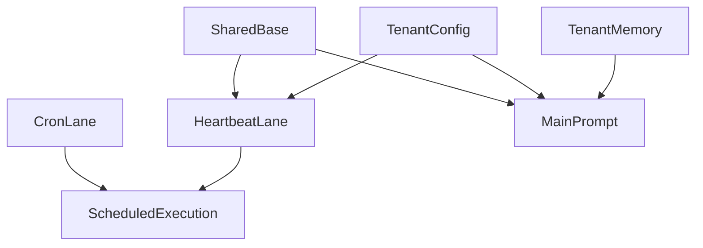

# Nanobot Workspace 分层设计草案

## 目的

这份文档只用于梳理当前 `base`、租户文档、`memory`、`heartbeat`、`cron` 的职责边界。
当前阶段先统一概念和范围，不直接作为实现变更说明。

---

## 核心目标

- 明确哪些内容属于全局共享配置
- 明确哪些内容属于租户长期个性化配置
- 明确哪些内容属于自动沉淀的记忆
- 明确 `heartbeat` 与 `cron` 的语义边界
- 为后续“闺蜜级别 agent”的持续演进保留稳定扩展点

---

## 总体结论

当前系统应该分为 3 层：

1. Shared Base Layer
   所有租户共享的基础人格、工作原则、工具规则。

2. Tenant Configuration Layer
   每个租户自己的长期风格、用户画像、周期任务配置。

3. Tenant Runtime Memory Layer
   系统从对话中自动沉淀出的长期事实与历史归档。

`cron` 不属于文档层，而属于执行层。

---

## 分层结构

---

## Shared Base Layer

Shared Base 的职责是定义“这个 agent 的公共底座是什么”，不是记录某个租户的真实资料。

### `AGENTS.md`

职责：

- 定义 agent 的全局工作方式
- 定义对话原则、执行原则、边界意识
- 定义 memory / tools / schedule 的高层规则

不负责：

- 某个租户的个性化相处方式
- 某个用户的长期偏好

### `SOUL.md`

职责：

- 定义 agent 的共享人格底色
- 规定默认气质、关系感、表达风格
- 规定基础陪伴定位

不负责：

- 针对某个租户的关系风格微调
- 用户资料或任务

### `USER.md`

职责：

- 定义“用户画像应该记录什么”的共享结构
- 告诉系统哪些信息适合长期保存为用户资料
- 提供资料分类边界，而不是存放真实用户内容

不负责：

- 存放某个租户自己的真实画像内容
- 记录运行时记忆

### `TOOLS.md`

职责：

- 规定所有租户共用的工具调用纪律
- 规定文档写入目标选择规则
- 规定 `memory` / `heartbeat` / `cron` 的基本使用边界

不负责：

- 某个租户的定制工具策略

### 关于 Shared `HEARTBEAT.md`

当前设计下，不建议保留单独的 `base/HEARTBEAT.md`。

原因：

- heartbeat 更像执行通道，而不是独立的人格层
- 共享行为规则已经可以放进 `AGENTS.md` 与 `TOOLS.md`
- 单独再拆一个 shared heartbeat 文件，收益不大，容易与租户 `HEARTBEAT.md` 职责重叠

结论：

- `base` 默认只保留 `AGENTS.md`、`SOUL.md`、`USER.md`、`TOOLS.md`
- heartbeat 的共享规则统一收口到 `AGENTS.md` / `TOOLS.md`
- 真正的周期任务来源只保留租户 `HEARTBEAT.md`

---

## Tenant Configuration Layer

Tenant Layer 的职责是定义“这个租户长期希望 agent 怎么陪伴、怎么理解自己、怎么进行周期任务管理”。

### 租户 `SOUL.md`

职责：

- 记录该租户偏好的陪伴关系风格
- 记录该租户希望的语气、亲密度、直接程度
- 记录共享人格之上的租户级风格微调

适合放：

- 更像朋友还是更像顾问
- 更温柔还是更直接
- 更活泼还是更克制

不适合放：

- 动态记忆
- 临时任务
- 周期提醒清单

### 租户 `USER.md`

职责：

- 记录该租户长期稳定的用户画像默认值
- 记录长期称呼、assistant 在该租户下的稳定称呼、沟通方式、稳定边界、长期支持偏好

适合放：

- 固定称呼
- 用户对 assistant 的固定称呼
- 长期沟通偏好
- 稳定边界
- 长期需要温柔处理的话题

不适合放：

- 一次性情绪
- 临时事项
- 某次会话中的短期要求

### 租户 `HEARTBEAT.md`

职责：

- 记录该租户的周期任务清单
- 作为 heartbeat 定期轮询和回看的主要输入
- 适合承接“用户希望系统周期性 revisit 的事情”

适合放：

- 周期提醒
- 周期陪伴任务
- 长期回访项目
- 固定节奏的轻提醒

不适合放：

- 普通聊天人格规则
- 精确到某个绝对时间点的提醒

结论：

- 租户 `HEARTBEAT.md` 主要是“周期任务容器”
- gateway 定期触发 heartbeat 后，由 agent 读取它来决定这次需不需要执行

---

## Tenant Runtime Memory Layer

这一层不是“配置”，而是“自动沉淀结果”。

### `MEMORY.md`

职责：

- 保存系统从聊天中抽取出的长期稳定事实
- 作为主 prompt 热路径直接注入

适合放：

- 用户稳定称呼
- 长期偏好
- 长期约束
- 长期关系事实

不适合放：

- 周期任务
- prompt 规则
- 工具规范

### `HISTORY.md`

职责：

- 保存历史事件和归档痕迹
- 用于后续检索和回看

默认：

- 不直接进入主 prompt

---

## `heartbeat` 与 `cron` 的语义边界

这是后续设计里最需要稳定下来的部分。

### `heartbeat`

定义：

- 周期巡检
- 周期回访
- 周期性轻任务处理
- 更适合“看现在有没有该提醒 / 该关心 / 该回访的内容”

特点：

- 可以容忍轻度延迟
- 更偏“按周期扫描”
- 更像任务轮询器

典型例子：

- 每隔一段时间提醒喝水
- 每天回看一次护肤执行情况
- 每周问一次近期皮肤状态

### `cron`

定义：

- 精确定时执行器
- 用于明确时间点或严格固定周期的调度

特点：

- 时间语义更强
- 更适合绝对时间或明确 schedule
- 更像可靠调度器

典型例子：

- 今天 19:00 提醒去健身
- 明天早上 08:30 提醒出门
- 每周一 09:00 发送固定提醒

### 边界结论

- “周期回看 / 周期陪伴 / 轻轮询”优先进入 `HEARTBEAT.md`
- “精确定时 / 严格 schedule”优先进入 `cron`
- heartbeat 是周期执行通道，不单独需要一份 shared heartbeat 文档

---

## 文档写入原则

### Shared Base 文档

默认不由自动链路修改。

原因：

- 它们属于系统公共底座
- 不应该随着某个租户的聊天自动漂移

### 租户 `SOUL.md` / `USER.md` / `HEARTBEAT.md`

允许通过“单提取器 + 多目标分流”的后台链路增量更新。

原因：

- 这三份是“租户配置文档”
- 适合记录长期关系默认值、陪伴风格和周期任务
- 但不适合让模型整篇重写 markdown
- 更适合先提取结构化字段，再由代码渲染到自动管理区块

### `MEMORY.md` / `HISTORY.md`

可以继续由 structured memory 在后台自动沉淀。

原因：

- 它们本来就是运行时归纳层
- 适合从普通聊天中稳定增长

---

## 推荐的写入分工

| 目标 | 默认写入方式 | 是否允许后台自动沉淀 | 是否允许聊天驱动更新 | 说明 |
|---|---|---|---|---|
| `base/AGENTS.md` | 人工维护 | 否 | 否 | 全局行为规范 |
| `base/SOUL.md` | 人工维护 | 否 | 否 | 全局人格底色 |
| `base/USER.md` | 人工维护 | 否 | 否 | 用户资料结构规范 |
| `base/TOOLS.md` | 人工维护 | 否 | 否 | 全局工具规则 |
| 租户 `SOUL.md` | structured memory 分流 + 显式修改 | 否 | 是 | 租户级陪伴风格 |
| 租户 `USER.md` | structured memory 分流 + 显式修改 | 否 | 是 | 租户级稳定画像 |
| 租户 `HEARTBEAT.md` | structured memory 分流 + 显式修改 | 否 | 是 | 租户级周期任务 |
| `MEMORY.md` | structured memory | 是 | 是 | 长期稳定事实 |
| `HISTORY.md` | structured memory / consolidation | 是 | 是 | 历史归档 |
| `cron` | 调度工具写入 | 否 | 是 | 精确定时执行 |

---

## Structured Memory 后台链路

这一层的核心目标不是只更新 `MEMORY.md`，而是做“单提取器 + 多目标分流”。

### 它是不是每轮都会触发

在普通主回合里，基本会尝试触发一次后台 structured memory 提取。

但这里的“触发”指的是：

- 主回合结束后，系统尝试调度一个后台提取任务

不等于：

- 每次都会真的写入任何持久化目标

### 主触发条件

主回合结束后，只要满足下面条件，就会调度 structured memory：

- `structured_memory_manager` 已启用
- 当前用户消息不为空
- 这一轮没有显式的 `MEMORY.md` 写入动作

不满足这些条件时，就不会调度后台提取。

### 谁在触发

主触发点在主回合结束后的 `TurnProcessor`。

它在生成最终回复、保存 session、处理 deferred actions 之后，统一决定是否调度 structured memory。

### 它是不是有一个单独的大模型在做判断

是的，有。

structured memory 不是纯本地规则判断，而是会额外发起一次专门的大模型调用。

这个调用的目的不是聊天，而是做“稳定记忆提取”。

### 提取时喂给模型的依据

这个后台提取模型会看到：

- 当前 `MEMORY.md`
- 最近几条对话（默认截最近 6 条）
- 当前用户消息
- 本轮已经发给用户的 assistant 回复

然后让模型输出严格 JSON，判断：

- `should_write` 是否应该写入
- `items` 里有哪些稳定事实值得沉淀

### 当前提取规则

当前代码里，structured memory 的目标不是泛化地理解一切信息，而是提取“适合进入长期持久层的稳定事实或周期任务”。

当前支持的类别包括：

- `preferred_name`
- `preferred_address`
- `assistant_alias`
- `relationship_preference`
- `primary_language`
- `timezone`
- `communication_style`
- `response_length_preference`
- `skin_type`
- `skin_concern`
- `makeup_style`
- `product_preference`
- `ingredient_avoidance`
- `stable_beauty_preference`
- `support_preference`
- `decision_style`
- `sensitive_topic`
- `stable_constraint`
- `support_boundary`
- `daily_rhythm`
- `long_term_goal`
- `recurring_reminder`
- `recurring_checkin`
- `recurring_followup`

也就是说，它更偏向：

- 用户身份与称呼方式
- 用户对 assistant 的稳定称呼
- 长期沟通风格与回复偏好
- 稳定的护肤 / 美妆画像
- 长期支持偏好与边界
- 稳定作息与长期目标
- 轻量周期任务与周期回访项

它会显式忽略：

- 一次性任务
- 短期计划
- 临时情绪
- 寒暄客套

### 为什么“触发了但没写”

即使后台任务已经调度，也经常不会真正写入任何目标文档。

常见原因有：

- 模型返回 `should_write=false`
- 没提取到合法 `items`
- 提取出的信息和当前持久化内容重复
- 分流渲染后内容与原内容相比没有变化

### 这层和租户 `USER.md` / `SOUL.md` / `HEARTBEAT.md` 的关系

当前 structured memory 会先统一提取，再按规则分流到：

- `MEMORY.md`
- 租户 `USER.md`
- 租户 `SOUL.md`
- 租户 `HEARTBEAT.md`

其中：

- `MEMORY.md` 承接长期稳定事实
- `USER.md` 承接用户资料默认值与关系默认值
- `SOUL.md` 承接租户级语言风格与陪伴风格
- `HEARTBEAT.md` 承接轻量周期任务与周期回访项

这一层仍然不是“整篇文档自动重写”，而是：

- 模型先输出结构化字段
- 代码再把字段渲染到各文档的自动管理区块

### 租户 `SOUL.md` / `USER.md` / `HEARTBEAT.md` 现在由什么更新

它们当前的更新入口主要是：

- structured memory 提取后按目标分流写入
- 用户或模型显式发起文档写入
- agent 使用文件写工具写入 `overrides/SOUL.md`、`overrides/USER.md`、`overrides/HEARTBEAT.md`
- 写入后由文档存储层落到 `nb_tenant_documents`

其中：

- `USER.md` 适合记录租户级稳定画像，以及“用户如何称呼自己 / 如何称呼 assistant”这类稳定关系信息
- `SOUL.md` 适合记录租户级陪伴风格与关系风格
- `HEARTBEAT.md` 适合记录周期任务

也就是说，当前它们既支持聊天驱动的显式配置写入，也支持单提取器的后台结构化分流更新。

---

## 当前系统与这份设计的对应关系

### 已经基本匹配的部分

- Shared base 与 tenant override 已经有分层读取能力
- `MEMORY` 与 `HISTORY` 已经独立成单独存储层
- `HEARTBEAT` 已经有专门调度链路
- `cron` 已经是单独调度系统

### 当前仍然存在的偏差

1. 历史旧模板可能还残留在数据库里
   这些旧模板不会真正参与 prompt，但仍然会出现在表中

2. 租户 `SOUL.md` / `USER.md` / `HEARTBEAT.md` 仍需要进一步细化“何时应该修改”的规则
   当前虽然已经具备后台分流能力，但类别边界仍需继续收紧和验证

---

## 关于旧模板

当前旧模板残留的原因通常不是“现在还在 seed”，而是：

- 旧版本运行时已经把模板写进过数据库
- 新逻辑改为不再 seed 后，旧数据不会自动删除
- 当前代码只是过滤这些占位模板，不让它们参与 prompt

这意味着：

- 库里可能还能看到旧模板
- 但它们不一定真的在系统行为里生效

---

## 推荐的后续落地顺序

在你确认这份定义没有问题之后，建议按下面顺序执行：

1. 先把这套边界固化为正式文档
2. 清理数据库中的旧占位模板
3. 明确主聊天与 heartbeat 链路各自读取哪些文档
4. 之后再决定要不要为租户文档补“显式确认后写入”的能力

---

## 最终结论

如果目标是做一个长期陪伴、可持续个性化的闺蜜型 agent，那么最稳的结构是：

- Shared Base 负责定义公共底座
- Tenant Documents 负责定义租户长期配置
- Memory 负责沉淀自动学习结果
- Heartbeat 负责周期任务轮询与执行
- Cron 负责精确定时执行

这个边界清楚之后，后续无论是把 skill 存数据库、做更强的用户画像、还是加事件跟进链路，都还有足够扩展空间。
